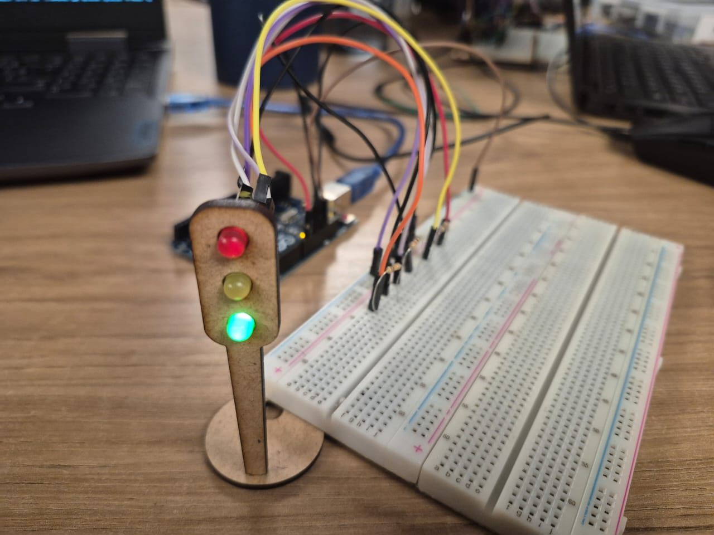

# Semaforo offline



## Relatorio

Projeto de semáforo offline para Arduino Uno que controla três LEDs (verde, amarelo e vermelho) usando millis() para temporizações não bloqueantes; o sistema realiza transições previsíveis entre as fases amarelo, vermelho e verde com intervalos ajustáveis, permitindo fácil extensão (botões, sensores, EEPROM) e montagem simples em protoboard com jumpers e resistores.

## Vídeo de demonstração:

https://youtube.com/shorts/u0INueWsoyM

## Código do arduino:

```cpp
const unsigned long intervaloLeitura = 2000;

unsigned long ultimoTempoLeitura = 0;
short int state = 1; // 1: Amarelo 2: Verde 3: Vermelho

void setup()
{
  pinMode(9, OUTPUT); // Vermelho
  pinMode(11, OUTPUT); // Amarelo
  pinMode(13, OUTPUT); // Verde
  Serial.begin(9600);
}

void loop()
{
  unsigned long tempoAtual = millis();

   /*
     Intervalo de leitura depende do estado:
     1. Amarelo: 2000
     2. Verde: 4000
     3. Vermelho: 6000
   */

   if (tempoAtual - ultimoTempoLeitura >= (intervaloLeitura * state)) {
        ultimoTempoLeitura = tempoAtual;  // Atualiza o último tempo de leitura

        if(state == 1) {
          // Liga a led vermelha se a led anterior foi amarela
          state = 3;
          digitalWrite(11, LOW);
          digitalWrite(9, HIGH);
        } else if(state == 2) {
          // Liga a led amarela se a led anterior foi verde
          state = 1;
          digitalWrite(13, LOW);
          digitalWrite(11, HIGH);
        } else if(state == 3) {
          // Liga a led verde se a led anterior foi vermelha
          state = 2;
          digitalWrite(9, LOW);
          digitalWrite(13, HIGH);
        }
    }
}
```

## Bill of material

| Item                                       | Quantidade | Observações                                    |
| ------------------------------------------ | ---------: | ---------------------------------------------- |
| Arduino Uno                                |          1 | -                                              |
| Protoboard (breadboard)                    |          1 | Para montagem dos componentes                  |
| LED (5 mm, cores à sua escolha)            |         3x | Use um resistor por LED                        |
| Jumpers (macho-macho ou conforme montagem) |         9x | Cabos para conexões                            |
| Cabo USB tipo A                            |          1 | Cabo para alimentação/programação (USB tipo A) |
| Resistores (220 ohms , 1/4 W recomendado)  |         3x | 220 ohms é recomendado para LEDs em 5V         |

## Avaliações

### Avaliador 1:

Gabriel Bartmanovicz

| Critério                                                                                                            | Contempla (Pontos) | Contempla Parcialmente (Pontos) | Não Contempla (Pontos) | Observações do Avaliador |
| ------------------------------------------------------------------------------------------------------------------- | -----------------: | ------------------------------: | ---------------------: | ------------------------ |
| Montagem física com cores corretas, boa disposição dos fios e uso adequado de resistores                            |              Até 3 |                         Até 1,5 |                      0 |                          |
| Temporização adequada conforme tempos medidos com auxílio de algum instrumento externo                              |              Até 3 |                         Até 1,5 |                      0 |                          |
| Código implementa corretamente as fases do semáforo e estrutura do código (variáveis representativas e comentários) |              Até 3 |                         Até 1,5 |                      0 |                          |
| Ir além: Implementou um componente extra, usou millis() ao invés do delay() e/ou utilizou ponteiros no código       |              Até 1 |                         Até 0,5 |                      0 |                          |
| **Pontuação Total**                                                                                                 |                 10 |                                 |                        |                          |

### Avaliador 2:

Thulio Bacco

| Critério                                                                                                            | Contempla (Pontos) | Contempla Parcialmente (Pontos) | Não Contempla (Pontos) | Observações do Avaliador |
| ------------------------------------------------------------------------------------------------------------------- | -----------------: | ------------------------------: | ---------------------: | ------------------------ |
| Montagem física com cores corretas, boa disposição dos fios e uso adequado de resistores                            |              Até 3 |                         Até 1,5 |                      0 |                          |
| Temporização adequada conforme tempos medidos com auxílio de algum instrumento externo                              |              Até 3 |                         Até 1,5 |                      0 |                          |
| Código implementa corretamente as fases do semáforo e estrutura do código (variáveis representativas e comentários) |              Até 3 |                         Até 1,5 |                      0 |                          |
| Ir além: Implementou um componente extra, usou millis() ao invés do delay() e/ou utilizou ponteiros no código       |              Até 1 |                         Até 0,5 |                      0 |                          |
| **Pontuação Total**                                                                                                 |                 10 |                                 |                        |                          |
